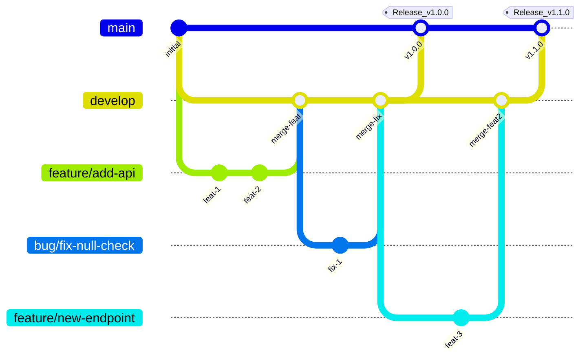
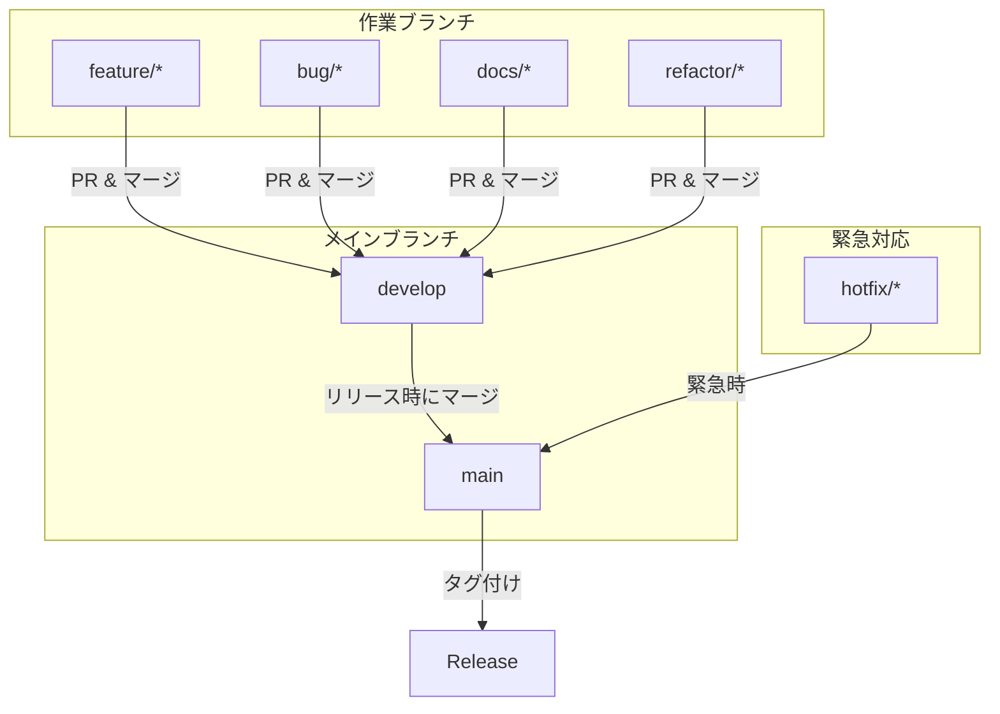
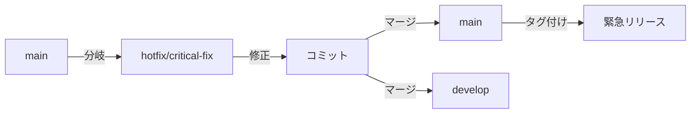

# ブランチ戦略とリリース手順

このドキュメントでは、本リポジトリのブランチ戦略とリリース手順について説明します。

本プロジェクトでは **GitFlow** をベースとしたブランチ戦略を採用しています。

---

## GitFlow 概要



---

## ブランチ構成

### メインブランチ

| ブランチ | 用途 | マージ元 |
|---------|------|---------|
| `main` | 安定版・リリース用。常にデプロイ可能な状態を維持 | `develop` |
| `develop` | 開発用の統合ブランチ。次回リリースの機能を集約 | `feature/*`, `bug/*` |

### 作業ブランチ

| プレフィックス | 用途 | 例 |
|--------------|------|-----|
| `feature/` | 新機能の追加 | `feature/add-export-api` |
| `bug/` | バグ修正 | `bug/fix-null-reference` |
| `hotfix/` | 本番環境の緊急修正（main から分岐） | `hotfix/critical-security-fix` |
| `docs/` | ドキュメントのみの変更 | `docs/update-readme` |
| `refactor/` | リファクタリング（機能変更なし） | `refactor/cleanup-client` |

---

## ブランチの流れ



---

## ブランチ命名規則

### 形式

```
<type>/<short-description>
```

### 例

| ブランチ名 | 説明 |
|-----------|------|
| `feature/add-user-api` | ユーザー API の追加 |
| `feature/support-pagination` | ページネーション対応 |
| `bug/fix-timeout-error` | タイムアウトエラーの修正 |
| `bug/handle-empty-response` | 空レスポンスのハンドリング |
| `hotfix/security-patch` | セキュリティパッチ（緊急） |
| `docs/add-examples` | サンプルコードの追加 |
| `refactor/simplify-http-client` | HTTP クライアントの簡素化 |

### ルール

- **小文字とハイフン**を使用（スペースやアンダースコアは避ける）
- **短く明確**な説明を心がける
- **Issue 番号**がある場合は含めてもよい（例: `bug/123-fix-null-check`）

---

## 開発フロー

### 1. 作業ブランチの作成

```bash
# develop から最新を取得
git checkout develop
git pull origin develop

# 作業ブランチを作成
git checkout -b feature/add-new-endpoint
```

### 2. 開発・コミット

```bash
# 変更をコミット
git add .
git commit -m "feat: add new endpoint for users"
```

### 3. プッシュ・PR 作成

```bash
# リモートにプッシュ
git push origin feature/add-new-endpoint
```

GitHub で `develop` に向けた Pull Request を作成します。

### 4. レビュー・マージ

- コードレビューを受ける
- 承認後、`develop` にマージ
- 作業ブランチは削除

---

## リリース手順

1. `develop` ブランチで開発・テストを完了
2. `develop` → `main` へ PR を作成しマージ
3. GitHub Actions の「Create Release」ワークフローを手動実行
4. バージョン種別（patch / minor / major）を選択
5. ワークフローが自動的に以下を実行：
   - バージョン番号の更新とコミット
   - Git タグの作成
   - NuGet パッケージの公開
   - GitHub Release の作成

---

## Hotfix フロー（緊急対応）

本番環境で緊急の修正が必要な場合は `hotfix/` ブランチを使用します。



### 手順

1. `main` から `hotfix/` ブランチを作成
2. 修正をコミット
3. `main` と `develop` の両方にマージ
4. リリースワークフローを実行
