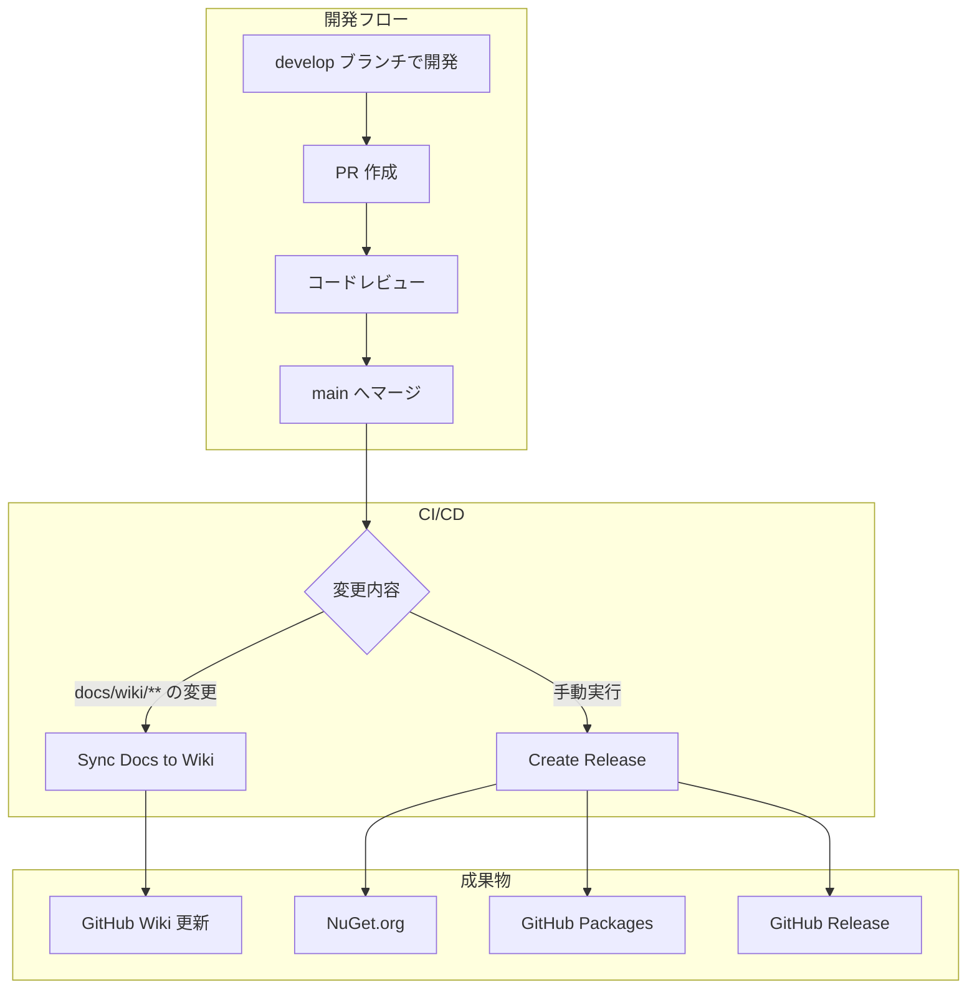
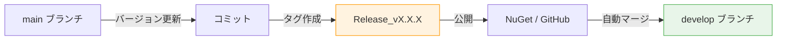
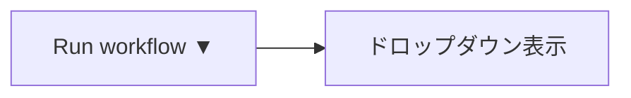
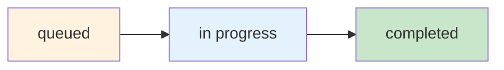
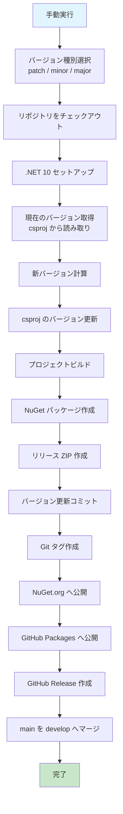
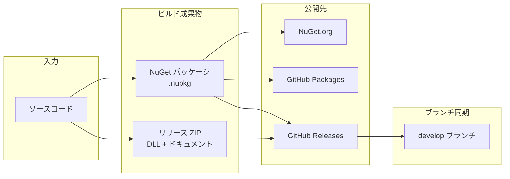
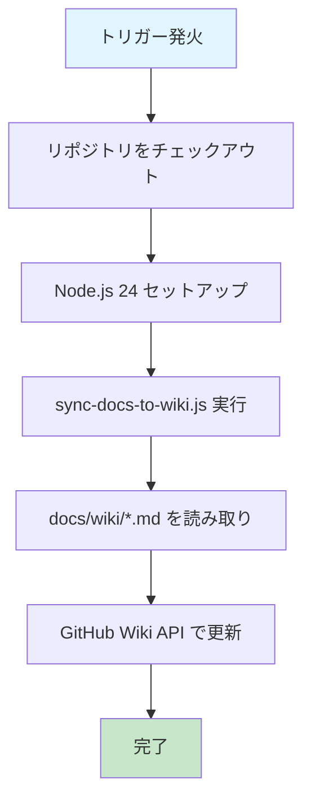
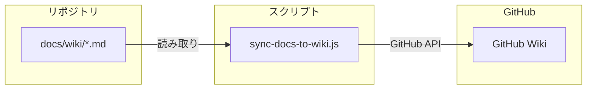

# CI/CD ワークフロー

このドキュメントでは、本リポジトリで使用している CI/CD ワークフローについて説明します。

## ワークフロー一覧

| ワークフロー | ファイル | トリガー | 目的 |
|-------------|---------|---------|------|
| Create Release | `release.yml` | 手動実行（main ブランチのみ） | バージョンアップ、NuGet パッケージ公開、GitHub Release 作成 |
| Sync Docs to Wiki | `sync-wiki.yml` | main への push（docs/wiki 配下の変更時）/ 手動実行 | Wiki ページの自動同期 |

---

## 全体フロー図



---

## 1. Create Release ワークフロー

### 概要

手動実行により、セマンティックバージョニングに基づいたリリースを作成します。

### 主な自動化機能

このワークフローでは以下の処理が **すべて自動化** されています：

| 機能 | 説明 |
|------|------|
| **バージョン番号の自動インクリメント** | 現在のバージョンを読み取り、選択した種別（patch/minor/major）に応じて自動計算 |
| **リリースタグの自動作成** | `Release_vX.X.X` 形式のタグを自動で作成・プッシュ |
| **パッケージの自動公開** | NuGet.org および GitHub Packages への公開 |
| **develop ブランチへの自動マージ** | リリース後、バージョン更新を develop に自動反映 |



> **ポイント**: リリース後に develop ブランチへ自動マージされるため、手動でのバージョン同期作業は不要です。

### トリガー

- **手動実行**（`workflow_dispatch`）
- **実行可能ブランチ**: `main` のみ

### バージョン種別

| 種別 | 説明 | 例 |
|------|------|-----|
| `patch` | バグ修正、小さな変更 | 1.0.0 → 1.0.1 |
| `minor` | 後方互換性のある機能追加 | 1.0.0 → 1.1.0 |
| `major` | 破壊的変更 | 1.0.0 → 2.0.0 |

### ワークフローの実行方法

#### 1. Actions タブを開く

GitHub リポジトリページで **Actions** タブをクリックします。

```
リポジトリトップ
├── Code
├── Issues
├── Pull requests
├── Actions        ← ここをクリック
├── Projects
└── ...
```

#### 2. ワークフローを選択

左側のワークフロー一覧から **Create Release** を選択します。

```
All workflows
├── Create Release     ← ここをクリック
└── Sync Docs to Wiki
```

#### 3. Run workflow を実行

右側に表示される **Run workflow** ボタンをクリックします。



#### 4. バージョン種別を選択して実行

ドロップダウンが表示されたら、以下の項目を設定して **Run workflow** ボタンをクリックします。

| 項目 | 設定内容 |
|------|---------|
| **Use workflow from** | `main`（変更不要） |
| **バージョンアップの種類** | `patch` / `minor` / `major` から選択 |

```
┌─────────────────────────────────────────┐
│ Use workflow from                       │
│ ┌─────────────────────────────────────┐ │
│ │ Branch: main                    ▼  │ │
│ └─────────────────────────────────────┘ │
│                                         │
│ バージョンアップの種類 *                │
│ ┌─────────────────────────────────────┐ │
│ │ patch                           ▼  │ │  ← ここで種別を選択
│ └─────────────────────────────────────┘ │
│   ・patch  (1.0.0 → 1.0.1)              │
│   ・minor  (1.0.0 → 1.1.0)              │
│   ・major  (1.0.0 → 2.0.0)              │
│                                         │
│            ┌──────────────────┐         │
│            │  Run workflow    │         │  ← クリックして実行
│            └──────────────────┘         │
└─────────────────────────────────────────┘
```

#### 5. 実行状況の確認

ワークフローが開始されると、実行状況を確認できます。



> **注意**: `main` ブランチ以外からは実行できません。`develop` ブランチから実行しようとするとワークフローがスキップされます。

### 処理フロー



### 成果物



### リリース ZIP の内容

```
PleasanterDeveloperCommunity.DotNet.Client_vX.X.X.zip
├── netstandard2.1/          # ビルド成果物
│   ├── PleasanterDeveloperCommunity.DotNet.Client.dll
│   └── ...
├── wiki/                    # ドキュメント
│   └── *.md
├── README.md
├── AUTHORS
└── LICENSE
```

### 必要なシークレット

| シークレット名 | 用途 |
|---------------|------|
| `GITHUB_TOKEN` | 自動提供。コミット、タグ、リリース作成に使用 |
| `NUGET_API_KEY` | NuGet.org への公開に使用 |

---

## 2. Sync Docs to Wiki ワークフロー

### 概要

`docs/wiki/` 配下の Markdown ファイルを GitHub Wiki に自動同期します。

### トリガー

- **自動**: `main` ブランチへの push（`docs/wiki/**/*.md` の変更時）
- **手動**: `workflow_dispatch`

### 処理フロー



### 同期の仕組み



---

## トラブルシューティング

### リリースワークフローが失敗する

| 症状 | 原因 | 対処法 |
|------|------|--------|
| `main` 以外で実行できない | ブランチ制限 | `main` ブランチから実行してください |
| NuGet 公開エラー | API キーの問題 | `NUGET_API_KEY` シークレットを確認 |
| パッケージが重複 | 同じバージョンが存在 | `--skip-duplicate` で自動スキップされます |

### Wiki 同期が動作しない

| 症状 | 原因 | 対処法 |
|------|------|--------|
| 同期されない | パスが異なる | `docs/wiki/` 配下の `.md` ファイルか確認 |
| 権限エラー | トークン権限 | `contents: write` 権限があるか確認 |


---

## 関連ドキュメント

- [ブランチ戦略とリリース手順](branch-strategy.md)

