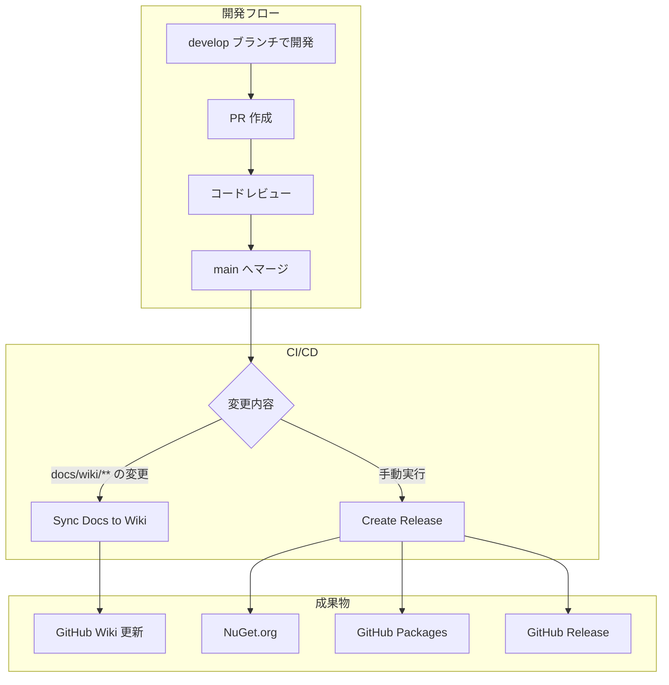
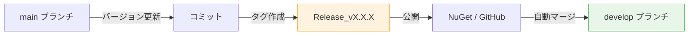
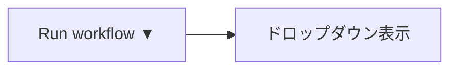
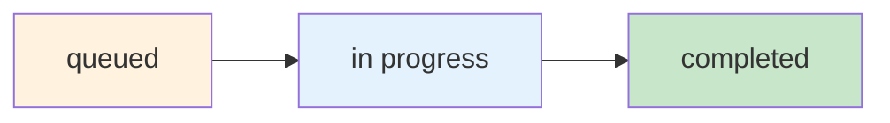
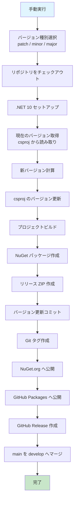
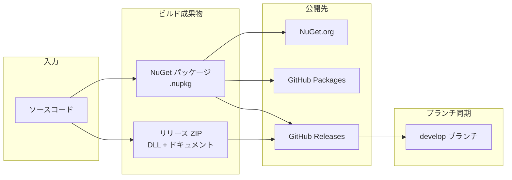
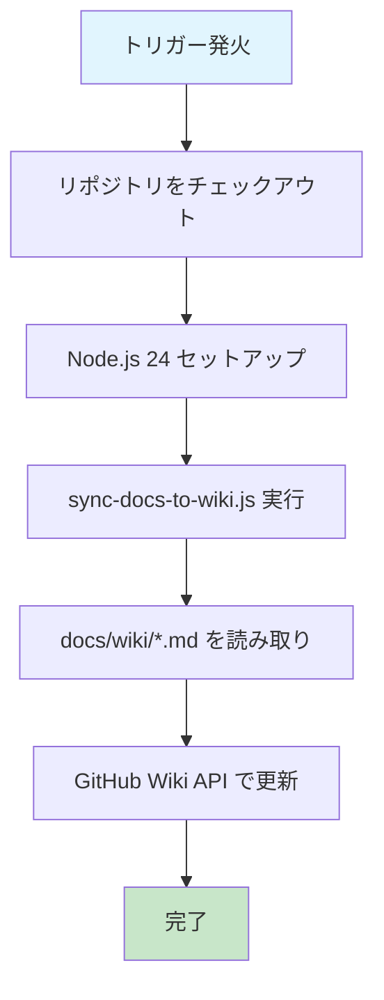
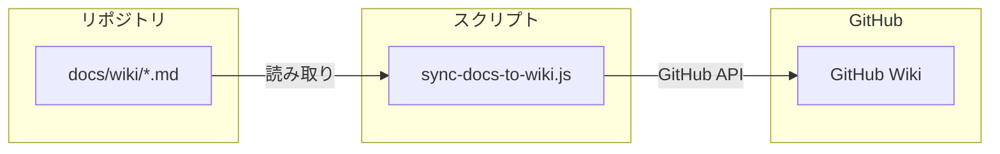
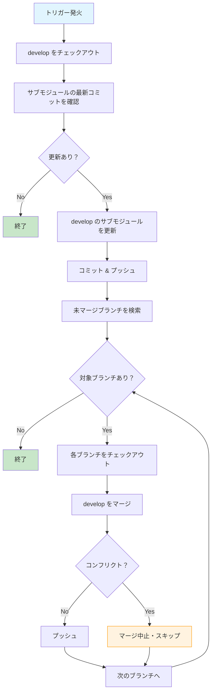

# CI/CD ワークフロー

このドキュメントでは、本リポジトリで使用している CI/CD ワークフローについて説明します。

<!-- START doctoc generated TOC please keep comment here to allow auto update -->
<!-- DON'T EDIT THIS SECTION, INSTEAD RE-RUN doctoc TO UPDATE -->

- [ワークフロー一覧](#ワークフロー一覧)
- [ローカルでのテスト実行](#ローカルでのテスト実行)
    - [コマンド](#コマンド)
- [全体フロー図](#全体フロー図)
- [1. Create Release ワークフロー](#1-create-release-ワークフロー)
    - [概要](#概要)
    - [主な自動化機能](#主な自動化機能)
    - [トリガー](#トリガー)
    - [バージョン種別](#バージョン種別)
    - [ワークフローの実行方法](#ワークフローの実行方法)
    - [処理フロー](#処理フロー)
    - [成果物](#成果物)
    - [リリース ZIP の内容](#リリース-zip-の内容)
    - [必要なシークレット](#必要なシークレット)
- [2. Sync Docs to Wiki ワークフロー](#2-sync-docs-to-wiki-ワークフロー)
    - [ワークフロー概要](#ワークフロー概要)
    - [実行トリガー](#実行トリガー)
    - [Wiki同期フロー](#wiki同期フロー)
    - [同期の仕組み](#同期の仕組み)
- [3. Update Submodule ワークフロー](#3-update-submodule-ワークフロー)
    - [ワークフロー概要](#ワークフロー概要-1)
    - [実行トリガー](#実行トリガー-1)
    - [対象ブランチ](#対象ブランチ)
    - [処理フロー](#処理フロー-1)
    - [サブモジュール追跡設定](#サブモジュール追跡設定)
- [トラブルシューティング](#トラブルシューティング)
    - [リリースワークフローが失敗する](#リリースワークフローが失敗する)
    - [Wiki 同期が動作しない](#wiki-同期が動作しない)
    - [サブモジュール更新が動作しない](#サブモジュール更新が動作しない)
- [関連ドキュメント](#関連ドキュメント)

<!-- END doctoc generated TOC please keep comment here to allow auto update -->

## ワークフロー一覧

| ワークフロー      | ファイル               | トリガー                                           | 目的                                                        |
| ----------------- | ---------------------- | -------------------------------------------------- | ----------------------------------------------------------- |
| Create Release    | `release.yml`          | 手動実行（main ブランチのみ）                      | バージョンアップ、NuGet パッケージ公開、GitHub Release 作成 |
| Sync Docs to Wiki | `sync-wiki.yml`        | main への push（docs/wiki 配下の変更時）/ 手動実行 | Wiki ページの自動同期                                       |
| Update Submodule  | `update-submodule.yml` | スケジュール（JST 8:00 / 12:00）/ 手動実行         | Implem.Pleasanter サブモジュールの自動更新                  |

---

## ローカルでのテスト実行

CI/CD でテストを自動実行する前に、ローカルでテストを実行することを推奨します。

### コマンド

```bash
# 全テストを実行
dotnet test

# 詳細なログを出力
dotnet test --logger "console;verbosity=detailed"

# カバレッジを収集
dotnet test --collect:"XPlat Code Coverage"
```

詳細は[テストガイドライン](testing-guidelines.md)を参照してください。

---

## 全体フロー図


```mermaid
flowchart TB
    subgraph 開発フロー
        A[develop ブランチで開発] --> B[PR 作成]
        B --> C[コードレビュー]
        C --> D[main へマージ]
    end

    subgraph CI/CD
        D --> E{変更内容}
        E -->|docs/wiki/** の変更| F[Sync Docs to Wiki]
        E -->|手動実行| G[Create Release]
    end

    subgraph 成果物
        F --> H[GitHub Wiki 更新]
        G --> I[NuGet.org]
        G --> J[GitHub Packages]
        G --> K[GitHub Release]
    end
```

---

## 1. Create Release ワークフロー

### 概要

手動実行により、セマンティックバージョニングに基づいたリリースを作成します。

### 主な自動化機能

このワークフローでは以下の処理が **すべて自動化** されています：

| 機能                                   | 説明                                                                          |
| -------------------------------------- | ----------------------------------------------------------------------------- |
| **バージョン番号の自動インクリメント** | 現在のバージョンを読み取り、選択した種別（patch/minor/major）に応じて自動計算 |
| **リリースタグの自動作成**             | `Release_vX.X.X` 形式のタグを自動で作成・プッシュ                             |
| **パッケージの自動公開**               | NuGet.org および GitHub Packages への公開                                     |
| **develop ブランチへの自動マージ**     | リリース後、バージョン更新を develop に自動反映                               |


```mermaid
flowchart LR
    A[main ブランチ] -->|バージョン更新| B[コミット]
    B -->|タグ作成| C[Release_vX.X.X]
    C -->|公開| D[NuGet / GitHub]
    D -->|自動マージ| E[develop ブランチ]

    style C fill:#fff3e0,stroke:#ff9800
    style E fill:#e8f5e9,stroke:#4caf50
```

> **ポイント**: リリース後に develop ブランチへ自動マージされるため、手動でのバージョン同期作業は不要です。

### トリガー

- **手動実行**（`workflow_dispatch`）
- **実行可能ブランチ**: `main` のみ

### バージョン種別

| 種別    | 説明                     | 例            |
| ------- | ------------------------ | ------------- |
| `patch` | バグ修正、小さな変更     | 1.0.0 → 1.0.1 |
| `minor` | 後方互換性のある機能追加 | 1.0.0 → 1.1.0 |
| `major` | 破壊的変更               | 1.0.0 → 2.0.0 |

### ワークフローの実行方法

#### 1. Actions タブを開く

GitHub リポジトリページで **Actions** タブをクリックします。

```text
リポジトリトップ
├── Code
├── Issues
├── Pull requests
├── Actions        ← ここをクリック
├── Projects
└── ...
```

#### 2. ワークフローを選択

左側のワークフロー一覧から **Create Release** を選択します。

```text
All workflows
├── Create Release     ← ここをクリック
└── Sync Docs to Wiki
```

#### 3. Run workflow を実行

右側に表示される **Run workflow** ボタンをクリックします。


```mermaid
flowchart LR
    A[Run workflow ▼] --> B[ドロップダウン表示]
```

#### 4. バージョン種別を選択して実行

ドロップダウンが表示されたら、以下の項目を設定して **Run workflow** ボタンをクリックします。

| 項目                       | 設定内容                             |
| -------------------------- | ------------------------------------ |
| **Use workflow from**      | `main`（変更不要）                   |
| **バージョンアップの種類** | `patch` / `minor` / `major` から選択 |

```text
┌─────────────────────────────────────────┐
│ Use workflow from                       │
│ ┌─────────────────────────────────────┐ │
│ │ Branch: main                    ▼  │ │
│ └─────────────────────────────────────┘ │
│                                         │
│ バージョンアップの種類 *                │
│ ┌─────────────────────────────────────┐ │
│ │ patch                           ▼  │ │  ← ここで種別を選択
│ └─────────────────────────────────────┘ │
│   ・patch  (1.0.0 → 1.0.1)              │
│   ・minor  (1.0.0 → 1.1.0)              │
│   ・major  (1.0.0 → 2.0.0)              │
│                                         │
│            ┌──────────────────┐         │
│            │  Run workflow    │         │  ← クリックして実行
│            └──────────────────┘         │
└─────────────────────────────────────────┘
```

#### 5. 実行状況の確認

ワークフローが開始されると、実行状況を確認できます。


```mermaid
flowchart LR
    A[queued] --> B[in progress] --> C[completed]

    style A fill:#fff3e0
    style B fill:#e3f2fd
    style C fill:#c8e6c9
```

> **注意**: `main` ブランチ以外からは実行できません。`develop` ブランチから実行しようとするとワークフローがスキップされます。

### 処理フロー


```mermaid
flowchart TD
    A[手動実行] --> B[バージョン種別選択<br/>patch / minor / major]
    B --> C[リポジトリをチェックアウト]
    C --> D[.NET 10 セットアップ]
    D --> E[現在のバージョン取得<br/>csproj から読み取り]
    E --> F[新バージョン計算]
    F --> G[csproj のバージョン更新]
    G --> H[プロジェクトビルド]
    H --> I[NuGet パッケージ作成]
    I --> J[リリース ZIP 作成]
    J --> K[バージョン更新コミット]
    K --> L[Git タグ作成]
    L --> M[NuGet.org へ公開]
    M --> N[GitHub Packages へ公開]
    N --> O[GitHub Release 作成]
    O --> P[main を develop へマージ]
    P --> Q[完了]

    style A fill:#e1f5fe
    style Q fill:#c8e6c9
```

### 成果物


```mermaid
flowchart LR
    subgraph 入力
        A[ソースコード]
    end

    subgraph ビルド成果物
        B[NuGet パッケージ<br/>.nupkg]
        C[リリース ZIP<br/>DLL + ドキュメント]
    end

    subgraph 公開先
        D[NuGet.org]
        E[GitHub Packages]
        F[GitHub Releases]
    end

    subgraph ブランチ同期
        G[develop ブランチ]
    end

    A --> B
    A --> C
    B --> D
    B --> E
    B --> F
    C --> F
    F --> G
```

### リリース ZIP の内容

```text
VehicleVision.Pleasanter.DotNet.Client_vX.X.X.zip
├── net10.0/                 # ビルド成果物
│   ├── VehicleVision.Pleasanter.DotNet.Client.dll
│   └── ...
├── wiki/                    # ドキュメント
│   └── *.md
├── LICENSES/                # サードパーティライセンス
│   └── *.txt
├── README.md
├── AUTHORS
└── LICENSE
```

### 必要なシークレット

| シークレット名  | 用途                                         |
| --------------- | -------------------------------------------- |
| `GITHUB_TOKEN`  | 自動提供。コミット、タグ、リリース作成に使用 |
| `NUGET_API_KEY` | NuGet.org への公開に使用                     |

---

## 2. Sync Docs to Wiki ワークフロー

### ワークフロー概要

`docs/wiki/` 配下の Markdown ファイルを GitHub Wiki に自動同期します。

### 実行トリガー

- **自動**: `main` ブランチへの push（`docs/wiki/**/*.md` の変更時）
- **手動**: `workflow_dispatch`

### Wiki同期フロー


```mermaid
flowchart TD
    A[トリガー発火] --> B[リポジトリをチェックアウト]
    B --> C[Node.js 24 セットアップ]
    C --> D[sync-docs-to-wiki.js 実行]
    D --> E[docs/wiki/*.md を読み取り]
    E --> F[GitHub Wiki API で更新]
    F --> G[完了]

    style A fill:#e1f5fe
    style G fill:#c8e6c9
```

### 同期の仕組み


```mermaid
flowchart LR
    subgraph リポジトリ
        A[docs/wiki/*.md]
    end

    subgraph スクリプト
        B[sync-docs-to-wiki.js]
    end

    subgraph GitHub
        C[GitHub Wiki]
    end

    A -->|読み取り| B
    B -->|GitHub API| C
```

---

## 3. Update Submodule ワークフロー

### ワークフロー概要

`Implem.Pleasanter` サブモジュールの `main` ブランチを定期的にチェックし、更新がある場合は `develop` ブランチに自動で反映します。さらに、未マージの作業ブランチには `develop` をマージすることでサブモジュール更新を伝搬し、マージ時のコンフリクトを防止します。

### 実行トリガー

- **スケジュール**: 毎日 JST 8:00（UTC 23:00）、JST 12:00（UTC 3:00）
- **手動**: `workflow_dispatch`

### 対象ブランチ

| ブランチ     | 説明                                                           |
| ------------ | -------------------------------------------------------------- |
| `develop`    | 最優先で更新。サブモジュールを `main` の最新コミットに直接更新 |
| `feature/*`  | develop をマージすることでサブモジュール更新を反映             |
| `bug/*`      | develop をマージすることでサブモジュール更新を反映             |
| `docs/*`     | develop をマージすることでサブモジュール更新を反映             |
| `refactor/*` | develop をマージすることでサブモジュール更新を反映             |

> **注意**: `hotfix/*` ブランチは `main` から派生するため、対象外です。

### 処理フロー


```mermaid
flowchart TD
    A[トリガー発火] --> B[develop をチェックアウト]
    B --> C[サブモジュールの最新コミットを確認]
    C --> D{更新あり？}
    D -->|No| E[終了]
    D -->|Yes| F[develop のサブモジュールを更新]
    F --> G[コミット & プッシュ]
    G --> H[未マージブランチを検索]
    H --> I{対象ブランチあり？}
    I -->|No| J[終了]
    I -->|Yes| K[各ブランチをチェックアウト]
    K --> L[develop をマージ]
    L --> M{コンフリクト？}
    M -->|No| N[プッシュ]
    M -->|Yes| O[マージ中止・スキップ]
    N --> P[次のブランチへ]
    O --> P
    P --> I

    style A fill:#e1f5fe
    style E fill:#c8e6c9
    style J fill:#c8e6c9
    style O fill:#fff3e0,stroke:#ff9800
```

### サブモジュール追跡設定

`.gitmodules` で追跡ブランチを `main` に設定しています：

```ini
[submodule "Implem.Pleasanter"]
    path = Implem.Pleasanter
    url = https://github.com/Implem/Implem.Pleasanter.git
    branch = main
```

ローカルで手動更新する場合は以下のコマンドを使用できます：

```bash
git submodule update --remote Implem.Pleasanter
```

---

## トラブルシューティング

### リリースワークフローが失敗する

| 症状                      | 原因                 | 対処法                                    |
| ------------------------- | -------------------- | ----------------------------------------- |
| `main` 以外で実行できない | ブランチ制限         | `main` ブランチから実行してください       |
| NuGet 公開エラー          | API キーの問題       | `NUGET_API_KEY` シークレットを確認        |
| パッケージが重複          | 同じバージョンが存在 | `--skip-duplicate` で自動スキップされます |

### Wiki 同期が動作しない

| 症状         | 原因         | 対処法                                   |
| ------------ | ------------ | ---------------------------------------- |
| 同期されない | パスが異なる | `docs/wiki/` 配下の `.md` ファイルか確認 |
| 権限エラー   | トークン権限 | `contents: write` 権限があるか確認       |

### サブモジュール更新が動作しない

| 症状                             | 原因                 | 対処法                                                        |
| -------------------------------- | -------------------- | ------------------------------------------------------------- |
| 更新がスキップされる             | サブモジュールが最新 | 正常動作。更新がない場合はスキップされます                    |
| ブランチの更新に失敗する         | ブランチ保護ルール   | 対象ブランチの保護ルールで bot のプッシュを許可してください   |
| `develop` ブランチが見つからない | ブランチ未作成       | `develop` ブランチを作成してください                          |
| 作業ブランチが更新されない       | ブランチ名が規則外   | `feature/`, `bug/`, `docs/`, `refactor/` プレフィックスか確認 |

---

## 関連ドキュメント

- [ブランチ戦略とリリース手順](branch-strategy.md)
