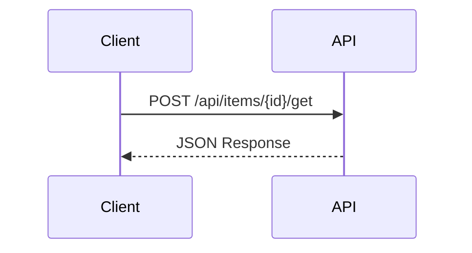

# ドキュメントガイドライン <!-- omit in toc -->

このドキュメントでは、PleasanterDeveloperCommunity.DotNet.Client プロジェクトのドキュメント作成規約について説明します。

## 目次 <!-- omit in toc -->

- [基本原則](#基本原則)
- [ファイル構成](#ファイル構成)
- [Markdownスタイル](#markdownスタイル)
- [APIドキュメント](#apiドキュメント)
- [ドキュメント同期](#ドキュメント同期)

---

## 基本原則

### 言語

- ドキュメントは**日本語**で記述する
- 技術用語は適宜英語のままでも可（例: API, HTTP, JSON）
- コードサンプル内のコメントも日本語で記述する

### 対象読者

- Pleasanter APIを利用する.NET開発者
- 本ライブラリへのコントリビューター

---

## ファイル構成

### ディレクトリ構造

```
docs/
├── contributing/
│   ├── coding-guidelines.md
│   ├── documentation-guidelines.md
│   ├── branch-strategy.md
│   └── ci-workflow.md
├── wiki/
│   ├── 00-*.md
│   ├── 01-テーブル操作-*.md
│   └── 02-サイト操作-*.md
└── script/
    └── sync-docs-to-wiki.js
```

### ファイル命名規則

#### `docs/wiki/` 配下

`{カテゴリ番号}-{カテゴリ名}-{連番}-{機能名}.md` 形式

| 要素         | 説明                        | 例                    |
| ------------ | --------------------------- | --------------------- |
| カテゴリ番号 | 2桁の数字（ソート用）       | `01`                  |
| カテゴリ名   | 機能カテゴリ                | `テーブル操作`        |
| 連番         | 2桁の数字（カテゴリ内順序） | `03`                  |
| 機能名       | 具体的な機能                | `レコード-取得(単一)` |

**例**:

- `00-タイムアウトとキャンセル.md`
- `01-テーブル操作-01-レコード-作成.md`
- `01-テーブル操作-03-レコード-取得(単一).md`

#### `docs/contributing/` 配下

`{トピック名}.md` 形式（ケバブケース推奨）

**例**:

- `coding-guidelines.md`
- `branch-strategy.md`

---

## Markdownスタイル

### 基本ルール

| ルール         | 説明                                             |
| -------------- | ------------------------------------------------ |
| 絵文字禁止     | ドキュメント内で絵文字を使用しない               |
| 図はMermaid    | 図やダイアグラムはMermaid記法を使用する          |
| テーブルの列幅 | 列幅を揃えて見やすく整形する（Prettierで自動化） |
| 見出しレベル   | `#` から順に使用、レベルを飛ばさない             |
| コードブロック | 言語指定を必ず付ける（```csharp）                |

### フォーマッター（Prettier）

テーブルの列幅整形などはPrettierで自動化されている。

#### セットアップ

1. VS Code拡張機能 `esbenp.prettier-vscode` をインストール
2. `.vscode/extensions.json` に推奨拡張機能として登録済み
3. 保存時に自動フォーマットが適用される

#### 設定ファイル

| ファイル                | 説明                         |
| ----------------------- | ---------------------------- |
| `.prettierrc`           | Prettierの設定               |
| `.prettierignore`       | フォーマット対象外のファイル |
| `.vscode/settings.json` | VS Code用の設定              |

#### 手動実行

VS Codeで `Shift + Alt + F`（Windows）または `Shift + Option + F`（Mac）でフォーマットを実行。

### 目次の自動生成（Markdown All in One）

目次の生成・更新は Markdown All in One 拡張機能で自動化されている。

#### セットアップ

1. VS Code拡張機能 `yzhang.markdown-all-in-one` をインストール
2. `.vscode/extensions.json` に推奨拡張機能として登録済み
3. 保存時に目次が自動更新される

#### 目次の挿入

1. 目次を挿入したい位置にカーソルを置く
2. コマンドパレット（`Ctrl+Shift+P`）を開く
3. 「Markdown All in One: Create Table of Contents」を実行

#### 設定

| 設定                                  | 値       | 説明                   |
| ------------------------------------- | -------- | ---------------------- |
| `markdown.extension.toc.updateOnSave` | `true`   | 保存時に目次を自動更新 |
| `markdown.extension.toc.levels`       | `"2..3"` | H2〜H3を目次に含める   |

#### セクションを目次から除外

```markdown
## このセクションは除外 <!-- omit in toc -->
```

#### 必須の除外設定

以下の見出しには必ず `<!-- omit in toc -->` を付与すること：

| 見出し    | 理由                                   |
| --------- | -------------------------------------- |
| H1（`#`） | ドキュメントタイトルは目次に含めない   |
| `## 目次` | 目次セクション自体を目次に含めない     |

**例**:

```markdown
# ドキュメントタイトル <!-- omit in toc -->

## 目次 <!-- omit in toc -->

- [セクション1](#セクション1)
- [セクション2](#セクション2)

## セクション1
```

### 見出し

```markdown
# ドキュメントタイトル（H1は1つのみ）

## 大セクション

### 小セクション

#### サブセクション
```

### コードブロック

言語を必ず指定：

````markdown
```csharp
var client = new PleasanterClient(settings);
var response = await client.GetRecordAsync(siteId, recordId);
```
````

### テーブル

列幅を揃えて整形：

```markdown
| メソッド名          | 説明               | 戻り値              |
| ------------------- | ------------------ | ------------------- |
| `GetRecordAsync`    | レコードを取得する | `Task<ApiResponse>` |
| `CreateRecordAsync` | レコードを作成する | `Task<ApiResponse>` |
```

### Mermaid図

````markdown

````

### リンク

```markdown
<!-- 相対リンク -->

詳細は[コーディングガイドライン](coding-guidelines.md)を参照。

<!-- セクションへのリンク -->

[命名規則](#命名規則)を確認してください。
```

---

## APIドキュメント

### 構成テンプレート

各APIドキュメントは以下の構成で記述：

````markdown
# {機能名}

## 概要

{機能の簡単な説明}

## メソッド

### {メソッド名}

{メソッドの説明}

#### シグネチャ

```csharp
public async Task<ApiResponse<T>> MethodNameAsync(
    long param1,
    string param2,
    CancellationToken cancellationToken = default);
```

#### パラメータ

| パラメータ名        | 型                  | 説明           |
| ------------------- | ------------------- | -------------- |
| `param1`            | `long`              | パラメータ説明 |
| `param2`            | `string`            | パラメータ説明 |
| `cancellationToken` | `CancellationToken` | キャンセル用   |

#### 戻り値

{戻り値の説明}

#### 使用例

```csharp
var response = await client.MethodNameAsync(123, "value");
```

#### 注意事項

- {注意点1}
- {注意点2}
````

### XMLドキュメントとの整合性

- コード内のXMLドキュメントコメントとWikiドキュメントの内容を一致させる
- パラメータ名、戻り値の型、例外の説明を同期する

---

## ドキュメント同期

### 更新ルール

コードやワークフローを変更した場合は、関連するドキュメントも更新すること。

| 変更対象                            | 更新が必要なドキュメント                             |
| ----------------------------------- | ---------------------------------------------------- |
| 公開API（メソッド追加・変更・削除） | `docs/wiki/` 配下の該当ドキュメント                  |
| 依存パッケージの変更                | `README.md` のサードパーティライセンスセクション     |
| CI/CDワークフローの変更             | `docs/contributing/ci-workflow.md`                   |
| インストール方法の変更              | `README.md` のインストールセクション                 |
| プロジェクト設定の変更              | `README.md` および `.github/copilot-instructions.md` |
| セキュリティ脆弱性の報告対応        | `README.md` の謝辞セクション（報告者名を追記）       |

### GitHub Wiki同期

- `docs/wiki/` 配下のドキュメントはGitHub Wikiに同期される
- 同期スクリプト: `docs/script/sync-docs-to-wiki.js`
- CI/CDで自動実行される

---

## 参考リンク

- [Markdownガイド](https://www.markdownguide.org/)
- [Mermaid公式ドキュメント](https://mermaid.js.org/)
- [GitHub Flavored Markdown](https://github.github.com/gfm/)
