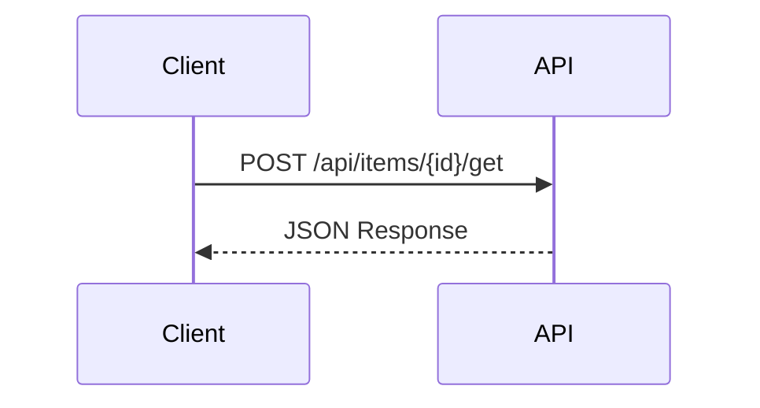

# ドキュメントガイドライン

このドキュメントでは、PleasanterDeveloperCommunity.DotNet.Client プロジェクトのドキュメント作成規約について説明します。

<!-- START doctoc generated TOC please keep comment here to allow auto update -->
<!-- DON'T EDIT THIS SECTION, INSTEAD RE-RUN doctoc TO UPDATE -->

- [ドキュメントガイドライン](#ドキュメントガイドライン)
  - [基本原則](#基本原則)
    - [言語](#言語)
    - [製品名の表記](#製品名の表記)
    - [対象読者](#対象読者)
  - [ファイル構成](#ファイル構成)
    - [ディレクトリ構造](#ディレクトリ構造)
    - [ファイル命名規則](#ファイル命名規則)
      - [`docs/wiki/` 配下](#docswiki-配下)
      - [`docs/contributing/` 配下](#docscontributing-配下)
  - [Markdownスタイル](#markdownスタイル)
    - [基本ルール](#基本ルール)
    - [型名の表記](#型名の表記)
    - [HTMLタグの使用](#htmlタグの使用)
    - [フォーマッター（Prettier）](#フォーマッターprettier)
      - [セットアップ](#セットアップ)
      - [設定ファイル](#設定ファイル)
      - [Prettier設定の詳細](#prettier設定の詳細)
      - [手動実行](#手動実行)
    - [Markdownlint](#markdownlint)
      - [設定ファイル](#設定ファイル-1)
      - [Markdownlint設定の詳細](#markdownlint設定の詳細)
    - [npmスクリプト](#npmスクリプト)
      - [前提条件](#前提条件)
      - [利用可能なスクリプト](#利用可能なスクリプト)
      - [スクリプトの対象ファイル](#スクリプトの対象ファイル)
      - [使用例](#使用例)
      - [推奨ワークフロー](#推奨ワークフロー)
      - [VS Codeタスクとの連携](#vs-codeタスクとの連携)
    - [目次の自動生成（doctoc）](#目次の自動生成doctoc)
      - [セットアップ](#セットアップ-1)
      - [TOCの生成・更新](#tocの生成更新)
      - [doctocの動作](#doctocの動作)
      - [生成されるTOC形式](#生成されるtoc形式)
      - [注意事項](#注意事項)
    - [見出し](#見出し)
    - [コードブロック](#コードブロック)
    - [テーブル](#テーブル)
    - [Mermaid図](#mermaid図)
    - [リンク](#リンク)
  - [APIドキュメント](#apiドキュメント)
    - [構成テンプレート](#構成テンプレート)
    - [セクション詳細](#セクション詳細)
    - [複数メソッドがある場合](#複数メソッドがある場合)
    - [パラメータテーブル形式](#パラメータテーブル形式)
      - [基本ルール](#基本ルール-1)
      - [記述例](#記述例)
      - [階層の表現](#階層の表現)
    - [レスポンステーブル形式](#レスポンステーブル形式)
    - [関連ドキュメントセクションのルール](#関連ドキュメントセクションのルール)
    - [公式マニュアル未記載APIのNote](#公式マニュアル未記載apiのnote)
      - [記載ルール](#記載ルール)
      - [記述例](#記述例-1)
    - [XMLドキュメントとの整合性](#xmlドキュメントとの整合性)
  - [PDF変換](#pdf変換)
    - [利用可能なコマンド](#利用可能なコマンド)
    - [実行例](#実行例)
    - [出力先](#出力先)
    - [PDF設定](#pdf設定)
    - [スタイルのカスタマイズ](#スタイルのカスタマイズ)
    - [VS Codeタスク](#vs-codeタスク)
    - [必要なパッケージ](#必要なパッケージ)
  - [ドキュメント同期](#ドキュメント同期)
    - [更新ルール](#更新ルール)
    - [GitHub Wiki同期](#github-wiki同期)
  - [参考リンク](#参考リンク)

<!-- END doctoc generated TOC please keep comment here to allow auto update -->

---

## 基本原則

### 言語

- ドキュメントは**日本語**で記述する
- 技術用語は適宜英語のままでも可（例: API, HTTP, JSON）
- コードサンプル内のコメントも日本語で記述する

### 製品名の表記

「Pleasanter」と「プリザンター」の表記は以下のルールに従う：

| 場面                   | 表記         | 例                                   |
| ---------------------- | ------------ | ------------------------------------ |
| 日本語文中での製品名   | プリザンター | 「プリザンターのAPIを利用する」      |
| 技術的な文脈・API名    | Pleasanter   | 「Pleasanter API」「Pleasanter本体」 |
| URL・パス              | Pleasanter   | `pleasanter.org`                     |
| コード内（クラス名等） | Pleasanter   | `PleasanterClient`                   |
| バッジ・ラベル         | Pleasanter   | `[![Pleasanter]...]`                 |

> **Note**: 日本語の文章中で製品を指す場合は「プリザンター」、技術的な名称やAPIを指す場合は「Pleasanter」を使用する。

### 対象読者

- プリザンターAPIを利用する.NET開発者
- 本ライブラリへのコントリビューター

---

## ファイル構成

### ディレクトリ構造

```text
docs/
├── contributing/
│   ├── branch-strategy.md
│   ├── ci-workflow.md
│   ├── coding-guidelines.md
│   ├── development-environment.md
│   ├── documentation-guidelines.md
│   ├── Home.md
│   ├── research-guidelines.md
│   ├── sandbox-guide.md
│   └── testing-guidelines.md
├── research/
│   ├── Home.md
│   └── (その他の調査ドキュメント)
├── script/
│   ├── decode-toc.js
│   ├── generate-pdf.js
│   ├── github-markdown.css
│   └── sync-docs-to-wiki.js
└── wiki/
    ├── Home.md
    ├── （カテゴリ番号-カテゴリ名）
    │   └── （連番-機能名）
    └── (その他のWikiドキュメント)
```

### ファイル命名規則

#### `docs/wiki/` 配下

`{カテゴリ番号}-{カテゴリ名}-{連番}-{機能名}.md` 形式

| 要素         | 説明                        | 例                    |
| ------------ | --------------------------- | --------------------- |
| カテゴリ番号 | 2桁の数字（ソート用）       | `01`                  |
| カテゴリ名   | 機能カテゴリ                | `テーブル操作`        |
| 連番         | 2桁の数字（カテゴリ内順序） | `03`                  |
| 機能名       | 具体的な機能                | `レコード-取得(単一)` |

**例**:

- `00-タイムアウトとキャンセル.md`
- `01-テーブル操作-01-レコード-作成.md`
- `01-テーブル操作-03-レコード-取得(単一).md`

#### `docs/contributing/` 配下

`{トピック名}.md` 形式（ケバブケース推奨）

**例**:

- `coding-guidelines.md`
- `branch-strategy.md`

---

## Markdownスタイル

### 基本ルール

| ルール         | 説明                                             |
| -------------- | ------------------------------------------------ |
| 絵文字禁止     | ドキュメント内で絵文字を使用しない               |
| 図はMermaid    | 図やダイアグラムはMermaid記法を使用する          |
| テーブルの列幅 | 列幅を揃えて見やすく整形する（Prettierで自動化） |
| 見出しレベル   | `#` から順に使用、レベルを飛ばさない             |
| コードブロック | 言語指定を必ず付ける（```csharp）                |

### 型名の表記

テーブル内で型名を記述する場合は、必ずバッククォートで囲むこと：

```markdown
<!-- Good -->

| パラメータ | 型              | 説明           |
| ---------- | --------------- | -------------- |
| `siteId`   | `long`          | サイトID       |
| `timeout`  | `TimeSpan?`     | タイムアウト   |
| `members`  | `List<string>?` | メンバーリスト |

<!-- Bad -->

| パラメータ | 型   | 説明     |
| ---------- | ---- | -------- |
| `siteId`   | long | サイトID |
```

### HTMLタグの使用

- **原則禁止**: MarkdownファイルでのHTMLタグ使用は原則禁止
- **例外**: テーブルセル内での改行に限り `<br>` タグの使用を許可

```markdown
<!-- 許可: テーブルセル内での改行 -->

| エンドポイント                            | 説明 |
| ----------------------------------------- | ---- |
| `/api/users/get`<br>`/api/users/{id}/get` | 取得 |

<!-- 禁止: テーブル外でのHTMLタグ -->

テキスト<br>改行 <!-- 代わりに行末スペース2つを使用 -->
```

### フォーマッター（Prettier）

テーブルの列幅整形などはPrettierで自動化されている。

#### セットアップ

1. VS Code拡張機能 `esbenp.prettier-vscode` をインストール
2. `.vscode/extensions.json` に推奨拡張機能として登録済み
3. 保存時に自動フォーマットが適用される

#### 設定ファイル

| ファイル                | 説明                         |
| ----------------------- | ---------------------------- |
| `.prettierrc`           | Prettierの設定               |
| `.prettierignore`       | フォーマット対象外のファイル |
| `.vscode/settings.json` | VS Code用の設定              |

#### Prettier設定の詳細

`.prettierrc`での主要な設定：

| 設定項目        | 値（Markdown） | 説明                             |
| --------------- | -------------- | -------------------------------- |
| `tabWidth`      | `4`            | Markdownでは4スペースインデント  |
| `printWidth`    | `120`          | 1行の最大文字数                  |
| `proseWrap`     | `preserve`     | 文章の折り返しを保持             |
| `endOfLine`     | `lf`           | 改行コードをLFに統一             |
| `useTabs`       | `false`        | タブではなくスペースを使用       |
| `singleQuote`   | `true`         | シングルクォートを優先（JSON等） |
| `trailingComma` | `es5`          | ES5互換の末尾カンマ              |

#### 手動実行

VS Codeで `Shift + Alt + F`（Windows）または `Shift + Option + F`（Mac）でフォーマットを実行。

### Markdownlint

Markdownの構文チェックにはmarkdownlintを使用している。

#### 設定ファイル

| ファイル                   | 説明                    |
| -------------------------- | ----------------------- |
| `.markdownlint-cli2.jsonc` | markdownlint-cli2の設定 |

#### Markdownlint設定の詳細

`.markdownlint-cli2.jsonc`での主要なルール設定：

| ルールID | ルール名           | 設定内容                                 | 説明                                   |
| -------- | ------------------ | ---------------------------------------- | -------------------------------------- |
| `MD007`  | リストのインデント | `indent: 4`                              | 4スペースでインデント                  |
| `MD013`  | 行の長さ           | `line_length: 120`, テーブル・コード除外 | 1行120文字まで、テーブル等は除外       |
| `MD024`  | 重複する見出し     | `siblings_only: true`                    | 同じ階層のみ重複チェック               |
| `MD033`  | HTMLタグ使用禁止   | `allowed_elements: ["br"]`               | `<br>`タグのみ許可（テーブル内改行用） |

### npmスクリプト

ドキュメントのlintとフォーマットはnpmスクリプトで実行できる。

#### 前提条件

Node.js環境が必要。セットアップ方法は[開発環境構築ガイド](development-environment.md)を参照。

> **Note**: 各スクリプトは実行前に `node_modules` の存在をチェックし、存在しない場合は自動的に `npm install` を実行する。そのため、初回実行時に手動で `npm install` を実行する必要はない。

#### 利用可能なスクリプト

| スクリプト     | コマンド               | 説明                                           |
| -------------- | ---------------------- | ---------------------------------------------- |
| `lint:md`      | `npm run lint:md`      | Markdownファイルの構文チェック                 |
| `lint:md:fix`  | `npm run lint:md:fix`  | 自動修正可能なlintエラーを修正                 |
| `format`       | `npm run format`       | Prettierでファイルをフォーマット               |
| `format:check` | `npm run format:check` | フォーマットのチェック（ファイルは変更しない） |
| `toc`          | `npm run toc`          | doctocでTOCを一括更新                          |
| `toc:all`      | `npm run toc:all`      | TOC更新 + Prettierフォーマットを一括実行       |
| `pdf`          | `npm run pdf`          | 全MarkdownファイルをPDFに変換                  |
| `pdf:wiki`     | `npm run pdf:wiki`     | WikiドキュメントのみをPDFに変換                |
| `pdf:research` | `npm run pdf:research` | リサーチドキュメントのみをPDFに変換            |

#### スクリプトの対象ファイル

各スクリプトの対象ファイルは以下のとおり：

| スクリプト        | `docs/**/*.md` | ルート`*.md` | 備考                                       |
| ----------------- | :------------: | :----------: | ------------------------------------------ |
| `lint:md`         |      Yes       |     Yes      | 全mdファイル対象                           |
| `lint:md:fix`     |      Yes       |     Yes      | 全mdファイル対象                           |
| `format`          |      Yes       |     Yes      | 全mdファイル対象                           |
| `format:check`    |      Yes       |     Yes      | 全mdファイル対象                           |
| `toc`（doctoc）   |      Yes       |     一部     | ルートは`README.md`と`CONTRIBUTING.md`のみ |
| `toc`（デコード） |      Yes       |     Yes      | 全mdファイル対象                           |
| `pdf`             |      Yes       |     Yes      | 全mdファイルをPDF化                        |
| `pdf:wiki`        |      Yes       |      No      | `docs/wiki/**/*.md`のみ                    |
| `pdf:research`    |      Yes       |      No      | `docs/research/**/*.md`のみ                |

> **Note**: ルートに新しいmdファイルを追加してTOC生成対象にする場合は、`package.json` の `toc` スクリプトにファイル名を追加すること。

#### 使用例

```bash
# Markdownファイルの構文をチェック
npm run lint:md

# lintエラーを自動修正
npm run lint:md:fix

# フォーマットをチェック（CI向け）
npm run format:check

# ファイルをフォーマット
npm run format

# wiki配下のTOCを一括更新
npm run toc

# TOC更新 + フォーマットを一括実行（推奨）
npm run toc:all
```

#### 推奨ワークフロー

1. 編集後に `npm run lint:md` で構文チェック
2. `npm run lint:md:fix` で自動修正可能なエラーを修正
3. `npm run toc:all` でTOC更新とフォーマットを一括適用
4. コミット前に `npm run format:check` で最終確認

#### VS Codeタスクとの連携

npmスクリプトはVS Codeのタスクとしても登録されている。`Ctrl+Shift+P` → `Tasks: Run Task` から `npm:` で始まるタスクを選択して実行できる。

新しいnpmスクリプトを追加した場合は、以下も更新すること：

| 更新対象                                       | 内容                         |
| ---------------------------------------------- | ---------------------------- |
| `.vscode/tasks.json`                           | 対応するタスクを追加         |
| `docs/contributing/development-environment.md` | ドキュメントタスク一覧に追記 |

### 目次の自動生成（doctoc）

目次の生成・更新は doctoc で自動化されている。

#### セットアップ

doctocはnpmパッケージとしてインストール済み。

```bash
npm install
```

#### TOCの生成・更新

```bash
# wiki配下のTOCを一括更新
npm run toc

# TOC更新 + フォーマットを一括実行
npm run toc:all
```

#### doctocの動作

- `<!-- START doctoc -->` と `<!-- END doctoc -->` の間にTOCを生成
- マーカーがない場合はH1の直後に自動挿入
- `--maxlevel 3` でH3までを目次に含める
- `--notitle` でTOCタイトル（`**Table of Contents**`）を省略
- 日本語リンクはデコードスクリプト（`docs/script/decode-toc.js`）で読みやすい形式に変換

#### 生成されるTOC形式

```markdown
<!-- START doctoc generated TOC please keep comment here to allow auto update -->
<!-- DON'T EDIT THIS SECTION, INSTEAD RE-RUN doctoc TO UPDATE -->

- [概要](#概要)
- [対応バージョン](#対応バージョン)
- [メソッド名](#メソッド名) - [パラメータ](#パラメータ) - [レスポンス](#レスポンス)

<!-- END doctoc generated TOC please keep comment here to allow auto update -->
```

#### 注意事項

- doctocはH1（`#`）も目次に含める（除外しない）
- `<!-- omit in toc -->` は **doctocでは使用不可**（Markdown All in One専用）
- `npm run toc`を実行するとdoctoc実行後に自動でデコードスクリプトが実行される

### 見出し

```markdown
# ドキュメントタイトル（H1は1つのみ）

## 大セクション

### 小セクション

#### サブセクション
```

### コードブロック

言語を必ず指定：

````markdown
```csharp
var client = new PleasanterClient(settings);
var response = await client.GetRecordAsync(siteId, recordId);
```
````

### テーブル

列幅を揃えて整形：

```markdown
| メソッド名          | 説明               | 戻り値              |
| ------------------- | ------------------ | ------------------- |
| `GetRecordAsync`    | レコードを取得する | `Task<ApiResponse>` |
| `CreateRecordAsync` | レコードを作成する | `Task<ApiResponse>` |
```

### Mermaid図

````markdown

````

### リンク

```markdown
<!-- 相対リンク -->

詳細は[コーディングガイドライン](coding-guidelines.md)を参照。

<!-- セクションへのリンク -->

[命名規則](#命名規則)を確認してください。
```

---

## APIドキュメント

### 構成テンプレート

各APIドキュメントは以下の構成で記述：

```text
# {機能名} - {エンドポイント}
<!-- doctoc マーカー -->       ← doctocが自動生成
## 概要
## 対応バージョン
## {メソッド名A}               ← H2（メソッドごとにセクションを分ける）
### パラメータ                 ← H3（メソッドの子）
### レスポンス                 ← H3（メソッドの子）
## {メソッド名B}               ← 複数メソッドがある場合
### パラメータ
### レスポンス
## 使用例
## 関連ドキュメント
```

### セクション詳細

````markdown
# {機能名} - {エンドポイント}

<!-- START doctoc generated TOC please keep comment here to allow auto update -->
<!-- DON'T EDIT THIS SECTION, INSTEAD RE-RUN doctoc TO UPDATE -->

- [概要](#概要)
- [対応バージョン](#対応バージョン)
- [MethodNameAsync](#methodnameasync) - [パラメータ](#パラメータ) - [レスポンス](#レスポンス)
- [使用例](#使用例)
- [関連ドキュメント](#関連ドキュメント)

<!-- END doctoc generated TOC please keep comment here to allow auto update -->

## 概要

{機能の簡単な説明}

## 対応バージョン

- プリザンター {バージョン}以降
    - {バージョン制約の理由}

## MethodNameAsync

```csharp
Task<ApiResponse<T>> MethodNameAsync(
    long param1,
    RequestModel request,
    TimeSpan? timeout = null,
    CancellationToken cancellationToken = default)
```

### パラメータ

{階層テーブル形式で記述 → パラメータテーブル形式 参照}

### レスポンス

{階層テーブル形式で記述 → レスポンステーブル形式 参照}

## 使用例

```csharp
var response = await client.MethodNameAsync(123, request);
```

## 関連ドキュメント

- [タイムアウトとキャンセル](00-タイムアウトとキャンセル)
- [レスポンスの処理](00-レスポンスの処理)
````

### 複数メソッドがある場合

複数のメソッドがある場合は、メソッドごとにH2セクションを作成する。
パラメータやレスポンスが他のメソッドと同じ場合は、リンクで参照する。

````markdown
## ImportAsync (byte[]版)

```csharp
Task<ApiResponse<ImportResponse>> ImportAsync(...)
```

### パラメータ

{テーブル形式で記述}

### レスポンス

{テーブル形式で記述}

## ImportAsync (Stream版)

```csharp
Task<ApiResponse<ImportResponse>> ImportAsync(...)
```

### パラメータ

{テーブル形式で記述}

### レスポンス

[ImportAsync (byte[]版) のレスポンス](#レスポンス)と同じ

## ImportFromFileAsync

```csharp
Task<ApiResponse<ImportResponse>> ImportFromFileAsync(...)
```

### パラメータ

{テーブル形式で記述}

### レスポンス

[ImportAsync (byte[]版) のレスポンス](#レスポンス)と同じ
````

### パラメータテーブル形式

パラメータとリクエストモデルは「空セル + 階層列」パターンで統合して記述する。

#### 基本ルール

| ルール     | 説明                                                                              |
| ---------- | --------------------------------------------------------------------------------- |
| 列構成     | `プロパティ#1`, `#2`, `#3`, ...（必要に応じて#4以降も追加）, `型`, `必須`, `説明` |
| #1         | メソッドパラメータ（`siteId`, `request`, `timeout`, `cancellationToken`）         |
| #2         | リクエストモデルのプロパティ                                                      |
| #3以降     | ネストされたオブジェクトのプロパティ（階層に応じて#4, #5, #6...と拡張）           |
| 空セル     | 該当階層がない場合は空セルにする                                                  |
| 配列要素   | オブジェクトプロパティを示す場合は `.` プレフィックスを付ける                     |
| 必須列     | 必須パラメータは `Yes`、任意は空欄                                                |
| 階層の深さ | 制限なし。すべてのプロパティの階層を表現する                                      |
| 循環参照   | 1回だけ循環させて打ち切る（無限展開を防ぐ）                                       |
| 型の表記   | 対象クラスの型名をそのまま記載する                                                |
| 継承       | 継承元クラスの記載は不要。ただし継承元を含む全 public set プロパティを記載        |

#### 記述例

```markdown
### パラメータ

| プロパティ#1        | #2                | #3                 | 型                    | 必須 | 説明                   |
| ------------------- | ----------------- | ------------------ | --------------------- | :--: | ---------------------- |
| `siteId`            |                   |                    | `long`                | Yes  | サイトID               |
| `request`           |                   |                    | `CreateRecordRequest` | Yes  | リクエストモデル       |
|                     | `Title`           |                    | `string?`             |      | タイトル               |
|                     | `Body`            |                    | `string?`             |      | 本文                   |
|                     | `ClassHash`       |                    | `Dictionary`          |      | 分類項目               |
|                     |                   | `<ClassA~Z>`       | `string`              |      | 分類値                 |
|                     | `AttachmentsHash` |                    | `Dictionary`          |      | 添付ファイル           |
|                     |                   | `<AttachmentsA~Z>` | `List`                |      | 添付ファイルリスト     |
|                     |                   | `.Guid`            | `string?`             |      | GUID                   |
|                     |                   | `.Name`            | `string?`             |      | ファイル名             |
|                     |                   | `.Size`            | `long`                |      | サイズ                 |
| `timeout`           |                   |                    | `TimeSpan?`           |      | リクエストタイムアウト |
| `cancellationToken` |                   |                    | `CancellationToken`   |      | キャンセルトークン     |
```

#### 階層の表現

| パターン             | #2          | #3                  | 説明                                   |
| -------------------- | ----------- | ------------------- | -------------------------------------- |
| 単純プロパティ       | `Title`     |                     | 直接の値                               |
| Dictionary           | `ClassHash` | `<ClassA~Z>`        | キーと値の型を示す                     |
| 配列要素のプロパティ |             | `.Guid`             | `.` プレフィックスで配列要素内を示す   |
| ネストオブジェクト   | `ImageHash` | `<key>` → `.Base64` | Dictionary → オブジェクト → プロパティ |

### レスポンステーブル形式

レスポンスもパラメータと同様に「空セル + 階層列」パターンで記述する。

継承元クラスの記載は不要だが、継承元を含む全 public get プロパティを記載すること。

```markdown
### レスポンス

| プロパティ#1 | #2            | #3     | 型        | 説明                 |
| ------------ | ------------- | ------ | --------- | -------------------- |
| `Id`         |               |        | `long`    | 作成されたレコードID |
| `StatusCode` |               |        | `int`     | ステータスコード     |
| `Message`    |               |        | `string?` | メッセージ           |
| `Response`   |               |        | `T`       | レスポンスデータ     |
|              | `ResultId`    |        | `long`    | 結果ID               |
|              | `CreatedTime` |        | `string?` | 作成日時             |
|              | `Data`        |        | `object`  | データオブジェクト   |
|              |               | `.Key` | `string`  | キー                 |
```

### 関連ドキュメントセクションのルール

- **プリザンター公式マニュアルへのリンクは記載しない**
- 本ライブラリ内の関連ドキュメントのみを記載する
- 汎用的なドキュメント（タイムアウトとキャンセル、レスポンスの処理など）を優先して記載

### 公式マニュアル未記載APIのNote

プリザンター公式マニュアルに記載がないAPIについては、概要セクションにNoteを追加する。

#### 記載ルール

| 未記載の範囲     | Note文言                                                                                  |
| ---------------- | ----------------------------------------------------------------------------------------- |
| コントローラ単位 | `このAPIはプリザンター公式マニュアルには記載されていません（コントローラ単位で未記載）。` |
| アクション単位   | `このAPIはプリザンター公式マニュアルには記載されていません（アクション単位で未記載）。`   |

#### 記述例

```markdown
## 概要

{機能の簡単な説明}

> **Note**: このAPIはプリザンター公式マニュアルには記載されていません（コントローラ単位で未記載）。
```

### XMLドキュメントとの整合性

- コード内のXMLドキュメントコメントとWikiドキュメントの内容を一致させる
- パラメータ名、戻り値の型、例外の説明を同期する

---

## PDF変換

MarkdownファイルをPDFに変換する機能を提供している。GitHubスタイルのCSSを適用し、見やすいPDFを生成できる。

### 利用可能なコマンド

| スクリプト     | 対象                    | 説明                           |
| -------------- | ----------------------- | ------------------------------ |
| `pdf`          | `docs/**/*.md`          | 全MarkdownファイルをPDFに変換  |
| `pdf:wiki`     | `docs/wiki/**/*.md`     | Wikiドキュメントのみを変換     |
| `pdf:research` | `docs/research/**/*.md` | リサーチドキュメントのみを変換 |

### 実行例

```bash
# 全ドキュメントをPDF化
npm run pdf

# Wikiドキュメントのみ
npm run pdf:wiki

# リサーチドキュメントのみ
npm run pdf:research

# 特定のファイルのみPDF化
npm run pdf -- docs/wiki/Home.md
```

### 出力先

PDFは `pdf-output/` ディレクトリに生成される（`.gitignore`で除外済み）。

### PDF設定

| 項目         | 値                                | 説明                              |
| ------------ | --------------------------------- | --------------------------------- |
| スタイル     | GitHubスタイル                    | 公式の`github-markdown-css`ベース |
| CSSファイル  | `docs/script/github-markdown.css` | ローカルに保存                    |
| フォーマット | A4                                | 用紙サイズ                        |
| マージン     | 20mm（上下左右）                  | 余白                              |
| フォント     | システムフォント（日本語対応）    | Meiryo、Yu Gothic等               |
| 幅制限       | なし                              | A4用紙全体を活用                  |

### スタイルのカスタマイズ

PDFのスタイルを変更したい場合は、以下のファイルを編集する：

| ファイル                          | 説明                                        |
| --------------------------------- | ------------------------------------------- |
| `docs/script/github-markdown.css` | GitHubスタイルのCSS（幅指定なし）           |
| `docs/script/generate-pdf.js`     | PDF生成スクリプト（マージン、用紙サイズ等） |

### VS Codeタスク

タスクパレット（`Ctrl+Shift+P` → `Tasks: Run Task`）から以下を実行可能：

- `npm: pdf` - 全MarkdownファイルをPDF化
- `npm: pdf:wiki` - WikiドキュメントをPDF化
- `npm: pdf:research` - リサーチドキュメントをPDF化

### 必要なパッケージ

| パッケージ  | 用途                     |
| ----------- | ------------------------ |
| `md-to-pdf` | Markdown→PDF変換エンジン |
| `glob`      | ファイルパターンマッチ   |

初回実行時は自動的に `npm install` が実行される。

---

## ドキュメント同期

### 更新ルール

コードやワークフローを変更した場合は、関連するドキュメントも更新すること。

| 変更対象                            | 更新が必要なドキュメント                             |
| ----------------------------------- | ---------------------------------------------------- |
| 公開API（メソッド追加・変更・削除） | `docs/wiki/` 配下の該当ドキュメント                  |
| 依存パッケージの変更                | `README.md` のサードパーティライセンスセクション     |
| CI/CDワークフローの変更             | `docs/contributing/ci-workflow.md`                   |
| インストール方法の変更              | `README.md` のインストールセクション                 |
| プロジェクト設定の変更              | `README.md` および `.github/copilot-instructions.md` |
| セキュリティ脆弱性の報告対応        | `README.md` の謝辞セクション（報告者名を追記）       |

### GitHub Wiki同期

- `docs/wiki/` 配下のドキュメントはGitHub Wikiに同期される
- 同期スクリプト: `docs/script/sync-docs-to-wiki.js`
- CI/CDで自動実行される

---

## 参考リンク

- [Markdownガイド](https://www.markdownguide.org/)
- [Mermaid公式ドキュメント](https://mermaid.js.org/)
- [GitHub Flavored Markdown](https://github.github.com/gfm/)
