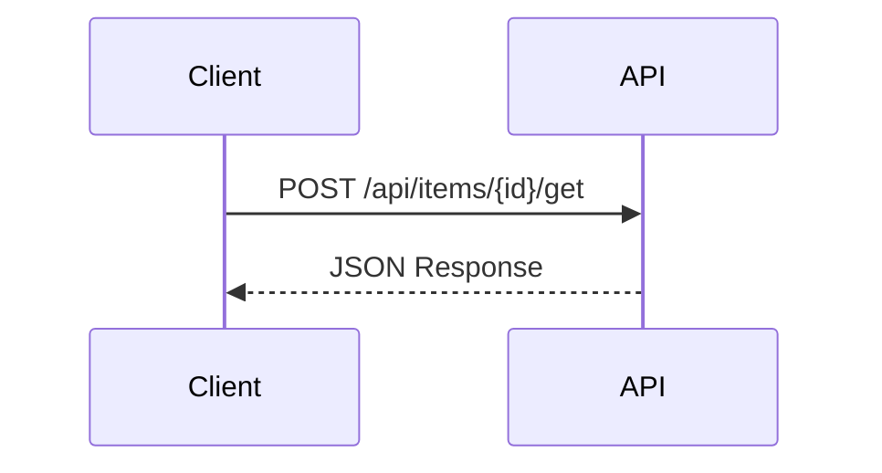
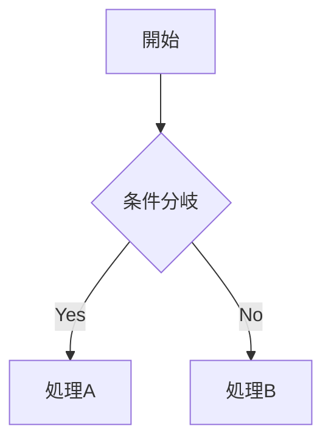

# リサーチガイドライン

このドキュメントでは、`docs/research/` 配下に格納するリサーチドキュメントの作成規約について説明します。

<!-- START doctoc generated TOC please keep comment here to allow auto update -->
<!-- DON'T EDIT THIS SECTION, INSTEAD RE-RUN doctoc TO UPDATE -->

- [目的](#目的)
- [ファイル命名規則](#ファイル命名規則)
    - [形式](#形式)
    - [ルール](#ルール)
    - [例](#例)
- [ドキュメント構成](#ドキュメント構成)
    - [必須セクション](#必須セクション)
    - [セクション詳細](#セクション詳細)
- [記述ルール](#記述ルール)
    - [タイトルの形式](#タイトルの形式)
    - [調査情報の形式](#調査情報の形式)
    - [水平線の使用](#水平線の使用)
- [図表の活用](#図表の活用)
    - [Mermaid 図](#mermaid-図)
    - [表形式](#表形式)
- [コード引用](#コード引用)
    - [ソースコード参照](#ソースコード参照)
    - [引用時の注意](#引用時の注意)
- [Home.md の更新](#homemd-の更新)
- [チェックリスト](#チェックリスト)
- [参考リンク](#参考リンク)

<!-- END doctoc generated TOC please keep comment here to allow auto update -->

---

## 目的

リサーチドキュメントは、PleasanterDeveloperCommunity.DotNet.Client の開発に必要な調査結果を蓄積するためのものです。

| 目的           | 説明                                             |
| -------------- | ------------------------------------------------ |
| 知見の蓄積     | プリザンター本体の内部実装に関する知見を文書化   |
| 仕様の明確化   | API の動作仕様や制約事項を明確にする             |
| 問題点の文書化 | 既知の問題点や注意事項を記録する                 |
| 開発判断の根拠 | 実装方針を決定する際の根拠となる調査結果を残す   |
| 将来の参照     | 同様の調査が必要になった際に再利用できる形で残す |

---

## ファイル命名規則

### 形式

```text
pleasanter-{調査対象}-{調査内容}.md
```

### ルール

| ルール         | 説明                                               |
| -------------- | -------------------------------------------------- |
| プレフィックス | プリザンター関連は `pleasanter-` を付ける          |
| ケバブケース   | 単語はハイフンで区切る（アンダースコアは使わない） |
| 英語で記述     | ファイル名は英語で記述する                         |
| 簡潔に         | 内容を端的に表す名前にする                         |

### 例

| ファイル名                             | 説明                                  |
| -------------------------------------- | ------------------------------------- |
| `pleasanter-upsert-implementation.md`  | Upsert API の実装調査                 |
| `pleasanter-session-api-retention.md`  | Sessions API のセッション有効期間調査 |
| `pleasanter-site-setting-history.md`   | SiteSetting 更新時の履歴記録調査      |
| `pleasanter-permission-inheritance.md` | 権限継承の仕組み調査                  |

---

## ドキュメント構成

### 必須セクション

すべてのリサーチドキュメントには以下のセクションを含めること。

```markdown
# {タイトル}

{概要説明（1〜2文）}

<!-- START doctoc generated TOC please keep comment here to allow auto update -->
<!-- END doctoc generated TOC please keep comment here to allow auto update -->

## 調査情報

| 調査日 | リポジトリ | ブランチ | タグ/バージョン | コミット | 備考   |
| ------ | ---------- | -------- | --------------- | -------- | ------ |
| {日付} | Pleasanter | {branch} | {tag}           | `{hash}` | {備考} |

## 調査目的

{調査の目的を簡潔に記述}

---

## {調査内容のセクション}

{本文}

---

## 結論

{調査結果のまとめ}
```

### セクション詳細

| セクション       | 必須 | 説明                                                     |
| ---------------- | :--: | -------------------------------------------------------- |
| タイトル（H1）   | Yes  | `{対象} {調査内容}調査` 形式（目次の上）                 |
| 概要説明         | Yes  | ドキュメントの概要を1〜2文で記述                         |
| doctoc マーカー  | Yes  | 目次の自動生成用マーカー                                 |
| 調査情報         | Yes  | 調査日、リポジトリ、ブランチ、タグ、コミット、備考を記載 |
| 調査目的         | Yes  | なぜこの調査が必要だったか                               |
| 調査内容         | Yes  | 調査結果の本文（複数セクション可）                       |
| 結論             | Yes  | 調査結果のまとめ（表形式推奨）                           |
| 関連ソースコード | 任意 | 参照したソースコードファイルの一覧                       |
| 注意事項         | 任意 | 利用者への注意喚起                                       |
| 関連リンク       | 任意 | 関連するドキュメントや外部リンク                         |

---

## 記述ルール

### タイトルの形式

```markdown
# プリザンター {対象} {調査内容}調査
```

**例**:

- `# プリザンター Upsert API 実装調査`
- `# プリザンター Sessions API セッション有効期間調査`
- `# プリザンター SiteSetting 更新時の変更履歴記録調査`

### 調査情報の形式

調査情報は**テーブル形式**で統一する（追加調査時に行を追加するだけで済むため）。
リポジトリ情報は列で分離し、**Gitコミットハッシュを必須**で記載すること。

#### 基本形式

```markdown
## 調査情報

| 調査日       | リポジトリ | ブランチ | タグ/バージョン | コミット  | 備考     |
| ------------ | ---------- | -------- | --------------- | --------- | -------- |
| 2026年2月3日 | Pleasanter | main     |                 | `abc1234` | 初回調査 |
```

#### タグ付きバージョンの場合

```markdown
## 調査情報

| 調査日       | リポジトリ | ブランチ | タグ/バージョン | コミット  | 備考     |
| ------------ | ---------- | -------- | --------------- | --------- | -------- |
| 2026年2月3日 | Pleasanter | main     | v1.4.10.0       | `abc1234` | 初回調査 |
```

#### 複数回調査の場合

追加調査を行った場合は、行を追加する。

```markdown
## 調査情報

| 調査日        | リポジトリ | ブランチ | タグ/バージョン | コミット  | 備考     |
| ------------- | ---------- | -------- | --------------- | --------- | -------- |
| 2026年2月3日  | Pleasanter | main     |                 | `abc1234` | 初回調査 |
| 2026年2月10日 | Pleasanter | main     | v1.4.10.0       | `def5678` | 追加調査 |
```

#### 列の説明

| 列              | 必須 | 説明                                                   |
| --------------- | :--: | ------------------------------------------------------ |
| 調査日          | Yes  | YYYY年MM月DD日形式で記載                               |
| リポジトリ      | Yes  | 調査対象のリポジトリ名（例: `Pleasanter`）             |
| ブランチ        | Yes  | 調査時点のブランチ名（例: `main`, `develop`）          |
| タグ/バージョン |      | 特定バージョンの場合はタグ名を記載（例: `v1.4.10.0`）  |
| コミット        | Yes  | **必須**。短縮形（7文字以上）または完全形で記載        |
| 備考            |      | 調査の目的や変更点を記載（例: `初回調査`, `追加調査`） |

### 水平線の使用

主要セクションの区切りには水平線（`---`）を使用する：

```markdown
## 調査目的

{内容}

---

## エンドポイント

{内容}
```

---

## 図表の活用

### Mermaid 図

処理フローやシーケンスは Mermaid 図で表現することを推奨：

````markdown

````

````markdown

````

### 表形式

比較や一覧は表形式で整理する：

```markdown
| 項目       | 値     | 説明            |
| ---------- | ------ | --------------- |
| パラメータ | `1440` | デフォルト値    |
| 単位       | 分     | 1440分 = 24時間 |
```

---

## コード引用

### ソースコード参照

プリザンター本体のソースコードを引用する場合：

````markdown
**ファイル**: `Implem.Pleasanter/Models/Sites/SiteUtilities.cs`（行番号: 100-120）

```csharp
public static ContentResultInheritance UpdateSiteSettingsByApi(
    Context context,
    SiteSettings ss,
    SiteModel siteModel)
{
    // 実装
}
```
````

### 引用時の注意

| ルール             | 説明                                 |
| ------------------ | ------------------------------------ |
| ファイルパスを明記 | どのファイルからの引用か明示する     |
| 行番号を記載       | 可能な場合は行番号も記載する         |
| 必要最小限の引用   | 説明に必要な部分のみ引用する         |
| コメントで補足     | 必要に応じてコード内にコメントを追加 |

---

## Home.md の更新

新しいリサーチドキュメントを追加した場合は、`docs/research/Home.md` のドキュメント一覧を更新すること。

```markdown
## ドキュメント一覧

| ドキュメント                                                               | 説明                            | 調査日     |
| -------------------------------------------------------------------------- | ------------------------------- | ---------- |
| [pleasanter-upsert-implementation.md](pleasanter-upsert-implementation.md) | Upsert API の実装調査           | 2026-02-03 |
| [pleasanter-session-api-retention.md](pleasanter-session-api-retention.md) | Sessions API セッション有効期間 | 2026-02-03 |
| [pleasanter-site-setting-history.md](pleasanter-site-setting-history.md)   | SiteSetting 履歴記録調査        | 2026-02-03 |
```

---

## チェックリスト

新しいリサーチドキュメントを作成する際のチェックリスト：

- [ ] ファイル名が命名規則に従っている
- [ ] doctoc マーカーが含まれている
- [ ] 調査日が記載されている
- [ ] 調査対象バージョンが記載されている
- [ ] 調査目的が明確に記述されている
- [ ] 結論セクションがある
- [ ] `npm run toc:all` で目次を生成した
- [ ] `Home.md` のドキュメント一覧を更新した

---

## 参考リンク

- [ドキュメントガイドライン](documentation-guidelines.md)
- [docs/research/Home.md](../research/Home.md)
